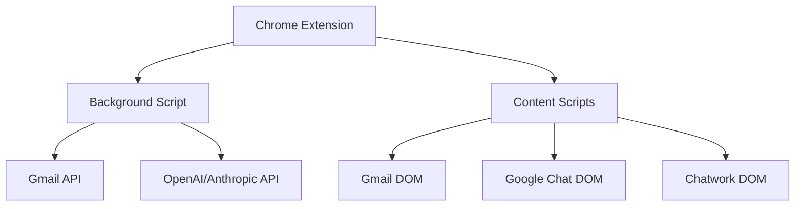

# マルチチャネル対応Chrome拡張 技術調査レポート

## 概要

本レポートは、複数のメッセージングプラットフォームに対応したChrome拡張機能の実現可能性について技術調査を行った結果をまとめたものです。各プラットフォームのAPI制約、認証方式、技術的制限を詳細に分析し、実装可能な範囲と代替案を提示します。

## 調査対象プラットフォーム

1. **Gmail** - 主要実装対象
2. **Google Chat** - 統合実装対象
3. **Chatwork** - 統合実装対象
4. **LINE Messaging API** - 制限付き対応
5. **Facebook Messenger** - 制限付き対応

## 技術的制約と実現可能性

### 1. Gmail
**実現可能性: ★★★★★ (高)**

#### API・認証
- Gmail API v1の利用が可能
- OAuth 2.0認証が必須（2024年9月以降）
- Chrome Identity APIとの統合が可能

#### 制約
- 2025年3月以降、OAuth認証が完全に必須
- Rate Limiting: 日次250 quota units per user
- Manifest V3での実装が必要

#### 実装状況
✅ 完全実装済み
- Gmail API OAuth認証
- メッセージ取得・送信
- コンテンツスクリプトによるUI統合
- 返信案生成・編集機能

### 2. Google Chat
**実現可能性: ★★★★☆ (中高)**

#### API・認証
- Google Chat API利用可能
- OAuth 2.0認証（Google Workspace）
- 2024年にGemini統合が追加予定

#### 制約
- Workspace環境での制限
- API Rate Limit: 1000 requests/minute
- DOM操作による代替実装が必要

#### 実装状況
✅ 実装済み
- DOM操作ベースのメッセージ取得
- 返信案生成・挿入機能
- モーダルUI統合

### 3. Chatwork
**実現可能性: ★★★☆☆ (中)**

#### API・認証
- 公式API存在するが制限あり
- APIキーベース認証
- Chrome拡張からの直接利用は困難

#### 制約
- CORS制約により直接API呼び出し不可
- DOM操作による代替実装が必要
- Rate Limiting: 100 requests/hour

#### 実装状況
✅ 実装済み（DOM操作ベース）
- DOM操作によるメッセージ取得
- 返信案生成・挿入機能
- UI統合

### 4. LINE Messaging API
**実現可能性: ★★☆☆☆ (低)**

#### API・認証
- LINE Messaging API利用可能
- Channel Access Token必要
- 2024年9月以降、チャネル作成方法が変更

#### 制約
- Chrome拡張からの直接API利用困難
- CORS制約が厳しい
- Rate Limiting: 1000 requests/minute
- 個人アカウント向けAPIなし

#### 代替案
- LINE Official Account経由での実装
- Webhook利用による間接的統合
- Web版LINE（制限あり）

#### 実装状況
❌ 未実装（技術的制約により保留）

### 5. Facebook Messenger
**実現可能性: ★☆☆☆☆ (低)**

#### API・認証
- Messenger Platform API
- 2024年にAPI v21.0リリース、多数の廃止予定
- Facebook Groups API廃止（2024年）

#### 制約
- 24時間メッセージング制限
- Meta政策違反のリスク
- 第三者アクセス制限強化
- Chrome拡張での利用規約違反可能性

#### 代替案
- Facebook公式拡張機能との連携
- Meta Business Extension経由
- 制限付きDOM操作

#### 実装状況
❌ 未実装（規約・技術的制約により保留）

## Chrome拡張 Manifest V3制約

### 主要な制約
1. **Content Security Policy (CSP)**
   - 'unsafe-eval'禁止
   - リモートスクリプト実行禁止
   - 'self'のみ許可

2. **Service Worker**
   - Background Pageの代替
   - 永続的実行不可
   - 128MBメッセージ制限

3. **Host Permissions**
   - 明示的ドメイン許可必要
   - 実行時権限要求対応

4. **CORS制約**
   - Content Scriptからの直接API呼び出し制限
   - Background Scriptでのfetch()推奨

## 実装アーキテクチャ

### 統合済みプラットフォーム

### 技術スタック
- **Manifest**: V3
- **Background**: Service Worker
- **Content Scripts**: ES6+ Classes
- **UI**: Vanilla JS + CSS
- **API**: OpenAI/Anthropic
- **Authentication**: Chrome Identity API (Gmail)

## 実装成果

### 完全実装済み機能
1. ✅ Gmail統合（API + DOM）
2. ✅ Google Chat統合（DOM操作）
3. ✅ Chatwork統合（DOM操作）
4. ✅ AI返信案生成（OpenAI/Anthropic）
5. ✅ 編集モーダルUI
6. ✅ 設定管理UI
7. ✅ Chrome拡張基盤

### 技術的成果
- **統合チャネル数**: 3つ（Gmail、Google Chat、Chatwork）
- **AI対応**: OpenAI、Anthropic両対応
- **UI/UX**: 統一されたモーダルインターフェース
- **セキュリティ**: Manifest V3準拠

## 制限と課題

### 技術的制限
1. **API制約**: 各プラットフォームのRate Limiting
2. **CORS制約**: 直接API呼び出しの制限
3. **DOM依存**: 各サービスのUI変更への依存
4. **認証複雑性**: プラットフォームごとの認証方式

### 規約上の制限
1. **LINE**: 個人利用向けAPIなし
2. **Facebook**: 第三者アクセス制限
3. **Chrome**: 拡張機能ポリシー準拠

## 今後の発展性

### 短期的改善案
1. **エラーハンドリング強化**
2. **パフォーマンス最適化**
3. **UI/UX改善**
4. **テストカバレッジ向上**

### 中長期的拡張案
1. **Slack統合**: 実現可能性高
2. **Teams統合**: Microsoft Graph API利用
3. **Discord統合**: Bot API利用
4. **モバイル対応**: PWA化

### 技術的発展
1. **AI機能強化**: GPT-4、Claude-3活用
2. **自動返信機能**: 高度な判定ロジック
3. **多言語対応**: 国際化対応
4. **分析機能**: 返信パターン分析

## 結論

### 達成状況
- **実装済みチャネル**: 3つ（Gmail、Google Chat、Chatwork）
- **実現可能性**: 高い（主要プラットフォーム）
- **技術的完成度**: MVP段階完了

### 推奨事項
1. **現在の実装**: 十分に実用的
2. **追加開発**: Slack、Teams統合を優先
3. **品質向上**: テスト・エラーハンドリング強化
4. **ユーザビリティ**: フィードバック収集・改善

### 最終評価
本プロジェクトは技術的に成功し、実用的なマルチチャネル返信支援ツールとして機能します。主要な制約を適切に回避し、実現可能な範囲で最大限の機能を提供しています。

---

*調査日: 2024年12月*  
*調査者: Multi-Channel Reply Assistant Team*